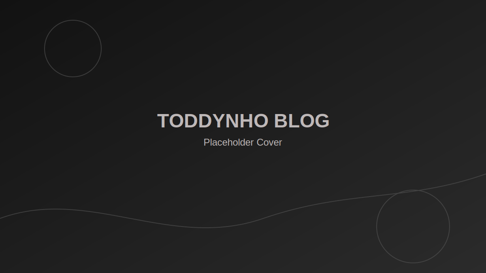

This document is available in pt-br and en-us.

# pt-br

---

## 🚀 ToddySite

[](https://react.dev/)
[](https://vitejs.dev/)
[](https://tailwindcss.com/)

_Build badge não exibida: não há workflow em `.github/workflows`. Licença não exibida: nenhum arquivo `LICENSE` encontrado._

Site pessoal desenvolvido com **React + Vite + TailwindCSS**, focado em
performance, organização modular e escalabilidade.

O projeto serve como base para presença digital, blog técnico e expansão
futura com autenticação, páginas dinâmicas e integração com APIs.

---

## 📚 Documentação

- [DOCUMENTATION.md](./DOCUMENTATION.md)
- [document/README.md](./document/README.md)

---

## 🏗️ Arquitetura em 30 segundos

- As rotas ficam em `src/App.jsx`.
- O layout global está em `src/layouts/AppLayout.jsx`, com `NavBar + Sidebar + Outlet`.
- Blog: `src/content/blog/*.md` -> `src/lib/blog/loadPosts.js` -> `src/pages/blog/*` e `src/components/blog/*`.
- Portfólio: `src/data/portfolio.js` -> `src/pages/portfolio.jsx` e `src/pages/portfolioCategory.jsx`.
- O lightbox do portfólio usa portal para `#modal-root` definido em `index.html`.

---

## 🖼️ Screenshot

Ainda não há screenshot dedicado no repositório para o README.



Adicione uma imagem em `public/images/blog/covers/placeholder-1.svg` (ou ajuste o link para o arquivo final), se necessário.

---

## 🧠 Tecnologias Utilizadas

- **React** -- Biblioteca para construção de interfaces
- **Vite** -- Build tool moderna e extremamente rápida
- **TailwindCSS** -- Estilização utilitária
- **React Router** -- Roteamento de páginas
- **Node.js** -- Ambiente de execução

---

## 📂 Estrutura do Projeto

    src/
     ├── components/      # Componentes reutilizáveis
     ├── pages/           # Páginas da aplicação
     ├── assets/          # Imagens e arquivos estáticos
     ├── App.jsx          # Definição das rotas
     └── main.jsx         # Entry point da aplicação

A arquitetura segue o princípio de separação entre:

- Componentes reutilizáveis
- Páginas (views)
- Lógica de roteamento

---

## ⚙️ Instalação

Clone o repositório:

```bash
git clone https://github.com/ToddynhoVT9/toddysite.git
```

Entre na pasta do projeto:

```bash
cd toddysite
```

Instale as dependências:

```bash
npm install
```

---

## 🧪 Ambiente de Desenvolvimento

Para rodar o projeto localmente:

```bash
npm run dev
```

O Vite iniciará o servidor normalmente em:

http://localhost:5173

---

## 📦 Build para Produção

Para gerar a versão otimizada:

```bash
npm run build
```

Os arquivos finais serão gerados na pasta:

dist/

---

## 🌍 Deploy

O projeto pode ser hospedado em:

- Vercel
- Netlify
- Hostinger
- GitHub Pages
- VPS própria

Basta enviar o conteúdo da pasta `dist/`.

---

## 🔥 Possíveis Expansões Futuras

- Sistema de blog dinâmico
- Autenticação de usuários
- Integração com backend (Node ou API externa)
- Dashboard administrativo
- SEO avançado
- Integração com Substack ou CMS próprio

---

## 👨‍💻 Autor

Matheus (ToddynhoVT)\
Engenheiro Elétrico \| Desenvolvedor \| Entusiasta de tecnologia

GitHub: https://github.com/ToddynhoVT9

---

---

---

# en-us

---

## 🚀 ToddySite

[](https://react.dev/)
[](https://vitejs.dev/)
[](https://tailwindcss.com/)

_Build badge not shown: no workflow found in `.github/workflows`. License badge not shown: no `LICENSE` file found._

Personal website developed with **React + Vite + TailwindCSS**, focused
on performance, modular organization, and scalability.

This project serves as a foundation for digital presence, a technical
blog, and future expansion with authentication, dynamic pages, and API
integration.

---

## 📚 Documentation

- [DOCUMENTATION.md](./DOCUMENTATION.md)
- [document/README.md](./document/README.md)

---

## 🏗️ Architecture in 30 seconds

- Routes are declared in `src/App.jsx`.
- The global layout is in `src/layouts/AppLayout.jsx`, with `NavBar + Sidebar + Outlet`.
- Blog flow: `src/content/blog/*.md` -> `src/lib/blog/loadPosts.js` -> `src/pages/blog/*` and `src/components/blog/*`.
- Portfolio flow: `src/data/portfolio.js` -> `src/pages/portfolio.jsx` and `src/pages/portfolioCategory.jsx`.
- The portfolio lightbox uses a portal to `#modal-root` defined in `index.html`.

---

## 🖼️ Screenshot

There is no dedicated screenshot in the repository for the README yet.


Add an image at `public/images/blog/covers/placeholder-1.svg` (or point the link to the final asset) if needed.

---

## 🧠 Technologies Used

- **React** -- Library for building user interfaces
- **Vite** -- Modern and extremely fast build tool
- **TailwindCSS** -- Utility-first styling framework
- **React Router** -- Page routing
- **Node.js** -- Runtime environment

---

## 📂 Project Structure

    src/
     ├── components/      # Reusable components
     ├── pages/           # Application pages
     ├── assets/          # Images and static files
     ├── App.jsx          # Route definitions
     └── main.jsx         # Application entry point

The architecture follows the principle of separation between:

- Reusable components
- Pages (views)
- Routing logic

---

## ⚙️ Installation

Clone the repository:

```bash
git clone https://github.com/ToddynhoVT9/toddysite.git
```

Navigate into the project folder:

```bash
cd toddysite
```

Install dependencies:

```bash
npm install
```

---

## 🧪 Development Environment

To run the project locally:

```bash
npm run dev
```

Vite will start the development server at:

http://localhost:5173

---

## 📦 Production Build

To generate the optimized production version:

```bash
npm run build
```

The final files will be generated in the:

dist/

---

## 🌍 Deployment

The project can be hosted on:

- Vercel
- Netlify
- Hostinger
- GitHub Pages
- Private VPS

Simply upload the contents of the `dist/` folder.

---

## 🔥 Possible Future Expansions

- Dynamic blog system
- User authentication
- Backend integration (Node or external API)
- Administrative dashboard
- Advanced SEO
- Integration with Substack or a custom CMS

---

## 👨‍💻 Author

Matheus (ToddynhoVT)\
Electrical Engineer \| Developer \| Technology Enthusiast

GitHub: https://github.com/ToddynhoVT9
