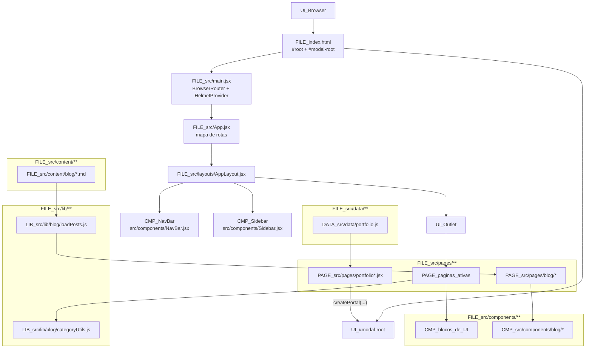

# 01 - Arquitetura Macro

## Fonte

- `document/docs/architecture/diagrama-arquitetura.md`
- `document/docs/architecture/mapa-modulos-relacoes.md`

## Diagrama (Mermaid)

## Notas

- O diagrama prioriza o mapa macro e os fluxos centrais de Blog e Portfolio descritos nas fontes.
- `UI_#modal-root` aparece separado para destacar que o lightbox do portfolio nao renderiza no fluxo normal do `UI_Outlet`.
- `PAGE_src/pages/blog/*` e `CMP_src/components/blog/*` representam conjuntos de arquivos, nao um componente unico.
