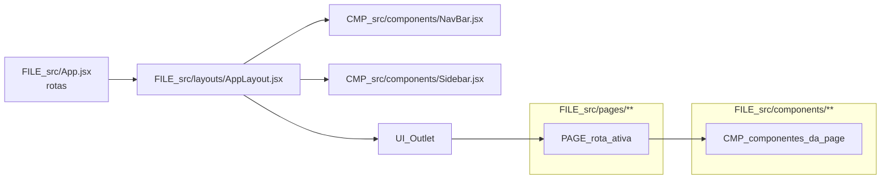
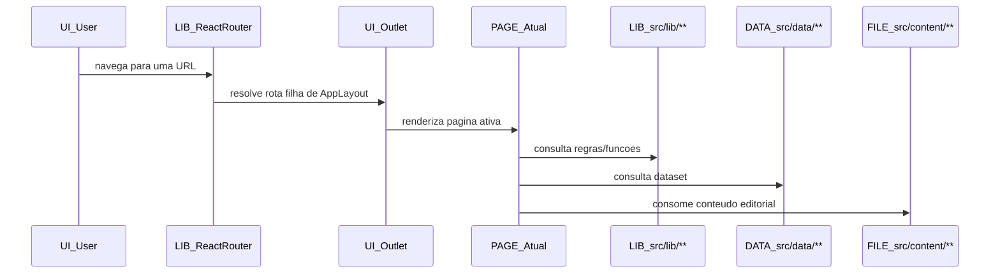

# 02 - Layout Global

## Fonte

- `document/docs/architecture/layout-global.md`
- `document/docs/architecture/diagrama-arquitetura.md`

## Diagrama 1 (flowchart)

## Diagrama 2 (sequenceDiagram)

## Notas

- O fluxo foca no comportamento documentado: `AppLayout` como wrapper com `NavBar`, `Sidebar` e `Outlet`.
- `Sidebar` pode ficar oculta em telas menores (`hidden lg:block`), mas continua parte da composicao global.
- O sequence resume o caminho de navegacao e consumo de dependencias da page sem detalhar implementacoes internas.
