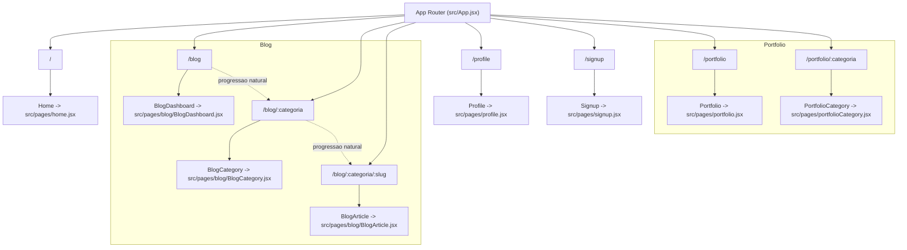

# 03 - Rotas e Navegacao

## Fonte

- `document/docs/architecture/rotas-e-navegacao.md`

## Diagrama (Mermaid)

## Notas

- O foco e o mapeamento de rotas definido em `src/App.jsx` conforme a fonte.
- As setas pontilhadas no bloco Blog indicam uma progressao comum de navegacao (dashboard -> categoria -> artigo).
