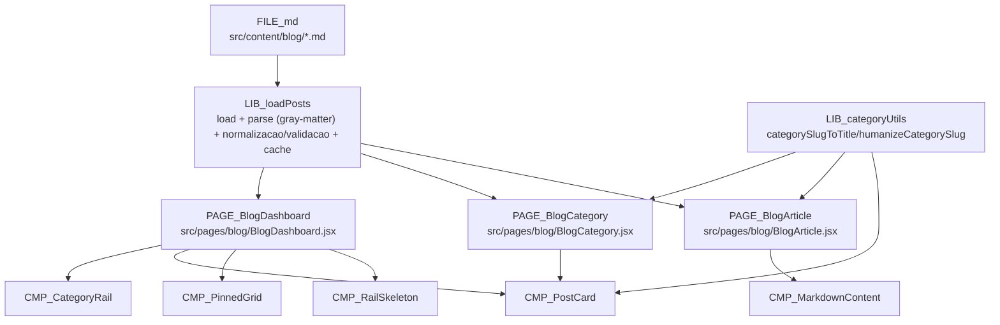
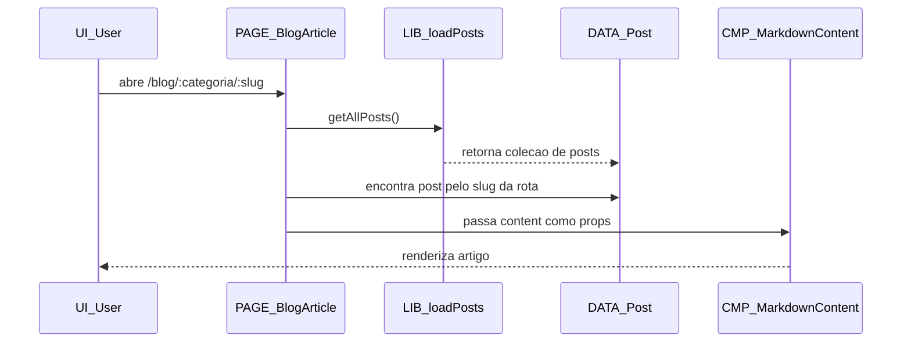

# 04 - Blog: Fluxo de Dados

## Fonte

- `document/modules/blog/01-visao-geral-e-fluxo.md`
- `document/lib/api-interna.md`

## Diagrama 1 (flowchart)

## Diagrama 2 (sequenceDiagram)

## Contratos

- `getAllPosts()`:
  - Retorna array de posts (copia rasa), com campos de frontmatter/conteudo normalizados (ex.: `title`, `slug`, `category`, `updatedAt`, `summary`, `cover`, `tags`, `pinned`, `content`, `file`).
- `getAllCategories()`:
  - Retorna array de categorias no formato alto nivel `{ slug, name, count }`.
- `getPostsByCategory(categorySlug)`:
  - Retorna array de posts filtrado pela categoria normalizada.
- `getPinnedPostsByCategory(categorySlug, limit = 3)`:
  - Retorna array de posts `pinned` da categoria, respeitando limite efetivo maximo de 3.
- `getLatestPosts(limit)`:
  - Retorna os N posts mais recentes do cache (ordenados por `updatedAt` desc).
- `categorySlugToTitle` (alias de `humanizeCategorySlug`):
  - Recebe slug e retorna titulo amigavel para exibicao.

## Notas

- No fluxo atual da pagina de artigo, a busca por slug e feita sobre `getAllPosts()`; nao ha export documentado como `getPostBySlug()`.
- `LIB_categoryUtils` aparece como etapa complementar porque e consumida por paginas/componentes no fluxo de exibicao.
