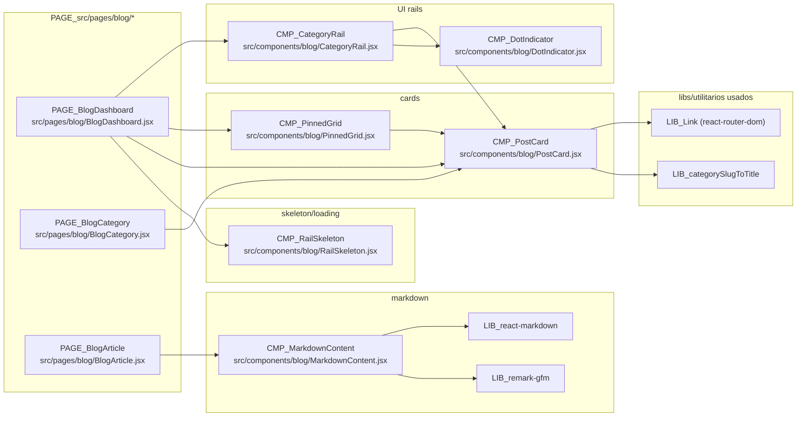

# 05 - Blog: Componentes

## Fonte

- `document/modules/blog/04-componentes.md`

## Diagrama (Mermaid)

## Notas

- O diagrama inclui somente dependencias e relacoes de importacao/uso citadas no documento-fonte.
- `CMP_DotIndicator` e `CMP_RailSkeleton` aparecem como nos proprios; nao possuem dependencias externas listadas.
