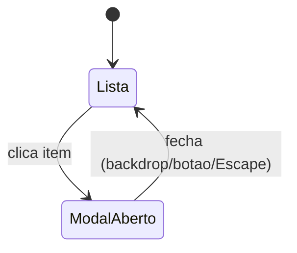
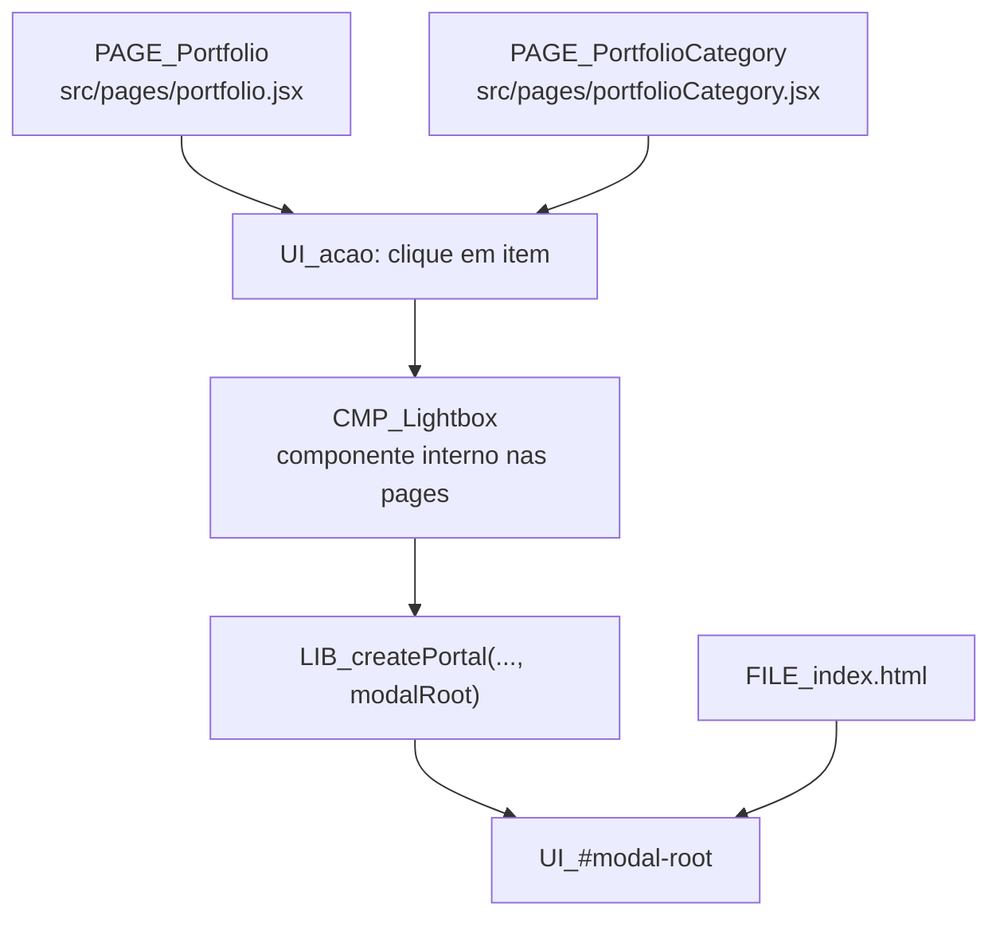

# 06 - Portfolio: Fluxo do Modal

## Fonte

- `document/modules/portfolio.md`
- `document/docs/architecture/mapa-modulos-relacoes.md`

## Diagrama 1 (stateDiagram-v2)

## Diagrama 2 (flowchart)

## Notas

- As duas paginas (`portfolio.jsx` e `portfolioCategory.jsx`) possuem implementacao propria de `Lightbox`, ambas com portal para `#modal-root`.
- O estado de fechamento do modal cobre os caminhos documentados: clique no backdrop, botao de fechar e tecla `Escape`.
