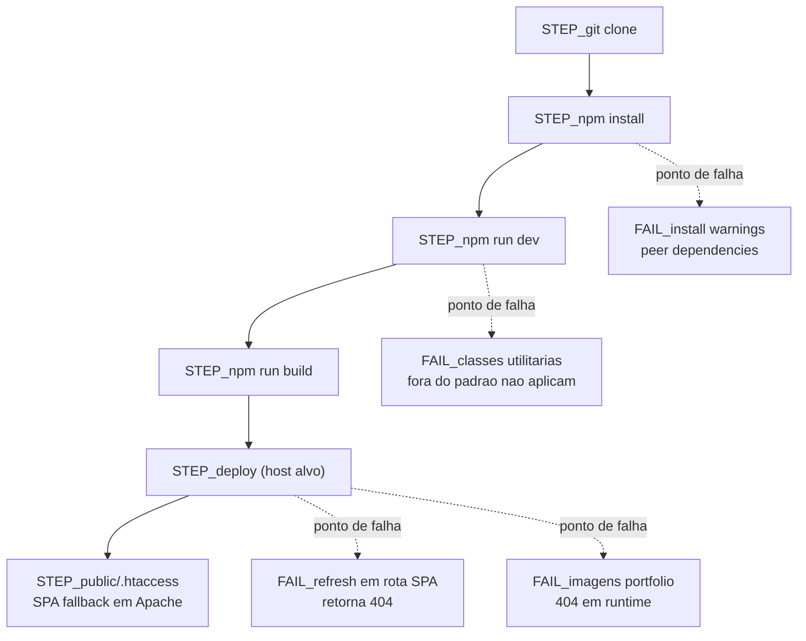

# 07 - Build e Deploy

## Fonte

- `document/docs/overview/20-como-rodar-build-deploy.md`
- `document/docs/qa/troubleshooting.md`
- `document/SETUP_PROJETO.md`

## Diagrama (Mermaid)

## Pontos de falha comuns

- Install com warnings de peer deps:
  - Ver: [90 - Troubleshooting](../docs/qa/troubleshooting.md#5-peer-deps-e-install-warnings-quando-aparecer-no-ambiente-local)
  - Relacao no diagrama: `STEP_npm install -> FAIL_install warnings`.
- Refresh em rotas SPA retorna 404 sem fallback:
  - Ver: [90 - Troubleshooting](../docs/qa/troubleshooting.md#2-refresh-em-rotas-spa-retorna-404-no-servidor)
  - Relacao no diagrama: `STEP_deploy -> FAIL_refresh em rota SPA retorna 404`.
- Imagens do portfolio retornando 404 apos deploy:
  - Ver: [90 - Troubleshooting](../docs/qa/troubleshooting.md#1-imagens-do-portfolio-retornando-404)
  - Relacao no diagrama: `STEP_deploy -> FAIL_imagens portfolio 404 em runtime`.
- Classes utilitarias fora do padrao nao aplicam como esperado:
  - Ver: [90 - Troubleshooting](../docs/qa/troubleshooting.md#3-classes-utilitarias-fora-do-padrao-tailwind-podem-nao-aplicar)
  - Relacao no diagrama: `STEP_npm run dev -> FAIL_classes utilitarias fora do padrao nao aplicam`.

## Notas

- O fluxo usa os scripts documentados: `npm run dev`, `npm run build` e (opcional para validacao local) `npm run preview`.
- Em servidor Apache, o fallback SPA equivalente a `public/.htaccess` e requisito para evitar 404 em refresh de rotas cliente.
- `document/SETUP_PROJETO.md` reforca pre-requisitos (Node/NPM) e alternativa `npm install --legacy-peer-deps` quando houver conflito de dependencias.
