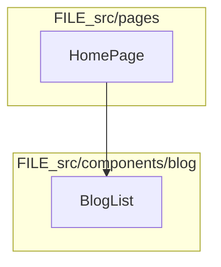
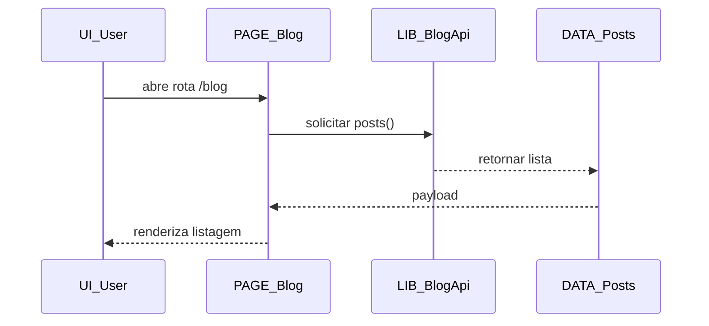

# 99 - Convencoes Mermaid

Este documento define o padrao visual e de nomenclatura para os diagramas em `document/flux/`.

## Prefixos de nos

- `UI_`: elementos de interface (botao, modal, pagina renderizada).
- `PAGE_`: paginas/rotas de alto nivel.
- `CMP_`: componentes React reutilizaveis ou especificos de modulo.
- `LIB_`: bibliotecas internas, hooks e utilitarios.
- `DATA_`: entidades de dados, colecoes e payloads.
- `FILE_`: arquivos de codigo ou configuracao quando o foco for estrutura.

## Direcao dos diagramas

- Arquitetura macro e fluxo vertical: `flowchart TB`.
- Relacoes entre componentes no mesmo nivel: `flowchart LR`.

## Uso de subgraph

- Use `subgraph` para agrupar por contexto tecnico.
- Exemplos de grupos recomendados:
  - `src/pages`
  - `src/components/blog`
  - `src/lib/blog`
- Nomeie subgraphs com termos claros e consistentes com o codigo.

## Checklist de consistencia

- O diagrama possui secao **Fonte** no topo com os `.md` usados.
- Prefixos dos nos seguem `UI_`, `PAGE_`, `CMP_`, `LIB_`, `DATA_`, `FILE_`.
- Direcao (`TB`/`LR`) esta adequada ao tipo de leitura.
- `subgraph` foi usado quando ha agrupamentos naturais.
- Nomes de nos estao curtos, objetivos e sem ambiguidade.
- Fluxo representa apenas informacao existente nos documentos-fonte.

## Mini-exemplo: flowchart

## Mini-exemplo: sequenceDiagram

